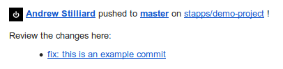

# Bitbucket webhook to check if someone pushed direct to master
[](https://app.fossa.io/projects/git%2Bgithub.com%2Fstilliard%2Fbitbucket-webhook-detect-master-push?ref=badge_shield)


This package can email multiple people when any developer pushes to master / production so that you can make sure that code was reviewed & tested:



Currently supports Bitbucket (though could support Github too).

& currently uses Mailgun but could easily support others via https://github.com/gabrielbull/omnimail

## Install with git clone

```
git clone https://github.com/stilliard/bitbucket-webhook-detect-master-push.git
```

Install depenancies with composer
```
composer install
```

Next copy the `.env.example` file to `.env` and fill in the varaibles with who to send to, from & your mailgun settings.

Then setup the apache vhost or nginx server file for this as needed.

Once setup, add a bibucket webhook for this & test it works.

-----

MIT license

Thanks to [Wildfire Internet](https://www.wildfireinternet.co.uk/) for supporting the development of this project.


## License
[](https://app.fossa.io/projects/git%2Bgithub.com%2Fstilliard%2Fbitbucket-webhook-detect-master-push?ref=badge_large)